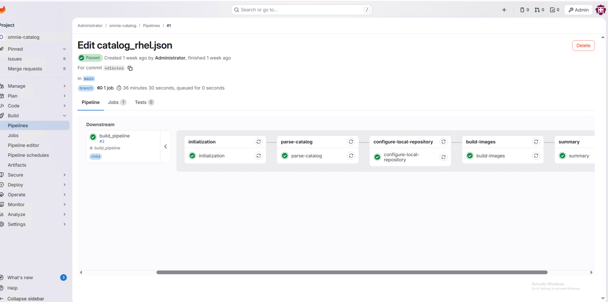

# Execute Build Pipeline

Update the `catalog_rhel.json` file and execute the BuildStreaM build pipeline through GitLab. This procedure covers catalog modifications, pipeline triggering (automatic and manual), and verification of pipeline status.

## Overview

The BuildStreaM build pipeline automates the creation of diskless images based on catalog specifications. The pipeline consists of three sequential stages:

- **parse-catalog**: Parses and validates the catalog file for build requirements
- **create-local-repository**: Creates and configures the local repository for build artifacts
- **build-image**: Builds the diskless images based on catalog specifications

The build pipeline is automatically triggered when you update the `catalog_rhel.json` file in the GitLab repository, or can be manually initiated through the GitLab interface.

!!! warning

    **Pipeline Retry Behavior**: If a pipeline fails partially (e.g., one architecture succeeds while another fails), retrying the pipeline may result in INTERNAL_ERROR for previously completed image builds. BuildStreaM currently does not skip or reuse already-successful builds during retry operations. If you encounter this issue, consider starting a fresh pipeline rather than retrying the failed one. Ensure adequate system resources (including 200 GB free disk space on OIM / partition) before initial pipeline execution to minimize the risk of partial failures.

!!! warning

    Do not cancel a running GitLab pipeline or stage. Cancellation prevents some pipeline steps from executing, which leaves the BuildStreaM job in an intermediate, inconsistent state.

!!! note

    The current GitLab configuration does not serialize pipelines. Concurrent
    pipelines can access shared resources, so avoid overlapping operations that
    update the same catalog, mapping, image, or deployment state.

!!! note

    Wait for another pipeline that uses the same catalog or image resources to
    finish before starting this build.

## Prerequisites

- BuildStreaM container is deployed on the OIM node
- GitLab deployment for BuildStreaM is completed (see [BuildStreaM](index.md))
- You can access the GitLab project repository
- **200 GB free disk space** on the OIM **/ partition** before triggering the build pipeline
  - This requirement applies to the OIM root partition before pipeline execution
  - Insufficient disk space can cause pipeline failures during image builds
  - Monitor disk usage during pipeline execution, especially for multi-architecture builds

### Repository content prerequisites

Select the RHEL 10.0 catalog that matches the workload, node architectures,
and VAST requirement from:

```text
src/main/samples/catalogs/10.0/
```

See [Select or update the catalog](../main/update_catalog.md) for the available
Slurm, service Kubernetes, combined, and `_no_vast` variants. Before starting
the pipeline, configure each repository referenced by the selected catalog in
`$OMNIA_DATA_PATH/repo_manager/input/$OMNIA_PROJECT_NAME/repo_manager_config.yml`.
Configure the Pulp service endpoint in
`$OMNIA_DATA_PATH/repo_manager/input/$OMNIA_PROJECT_NAME/repo_manager_endpoint_config.yml`.

| Repository content | Prerequisite |
|---|---|
| RHEL | Use an active RHEL subscription or provide reachable `baseos`, `appstream`, and `codeready-builder` URLs for every selected architecture. |
| Slurm | Host the catalog-required Slurm RPMs and configure `repositories."10.0".<architecture>.user_repos.slurm_custom.url`. Package names in the repository must match the selected catalog. |
| LDMS | Host the catalog-required `ovis-ldms` RPM and configure `repositories."10.0".<architecture>.user_repos.ldms.url`. The supplied RHEL 10.0 catalogs reference this repository. |
| VAST | When the selected catalog references `vast`—the Slurm variants without the `_no_vast.json` suffix—host the `vastnfs` RPM and configure `repositories."10.0".<architecture>.user_repos.vast.url`. A VAST repository is not required by the `_no_vast` variants. |

Each custom repository must expose `repodata/repomd.xml` and be reachable from
the OIM. Repo Manager synchronizes and publishes these repositories; it does
not build the Slurm, LDMS, or VAST RPMs. For configuration details, see
[Add an RPM Repository and Packages](../repo_manager/adding_additional_repositories.md) and
[Software Requirements](../../Reference/ClusterRequirements/software_requirements.md).

## Procedure

### Trigger Build Pipeline Automatically

1. Go to the GitLab project URL:

    ```text title="GitLab project URL"
    https://<gitlab_host>:<gitlab_https_port>/root/<gitlab_project_name>
    ```

2. Navigate to **Code** → **Repository**.

3. Locate the catalog file `catalog_rhel.json`.

4. Modify the `catalog_rhel.json` file to define your build requirements.

    !!! note

        Ensure that the catalog file is updated with valid values. The pipeline fails if invalid details are provided.

        Supported values:

        - **Functional group names**: `slurm_control_node_x86_64`, `slurm_node_x86_64`, `slurm_node_aarch64`, `service_kube_control_plane_x86_64`, `service_kube_node_x86_64`, `login_node_x86_64`, `login_node_aarch64`, `login_compiler_node_x86_64`, `login_compiler_node_aarch64`, `os_x86_64`, `os_aarch64`
        - **Architecture type**: `x86_64` and `aarch64`
        - **OS type**: `RHEL`
        - **OS version**: `10.0`
        - **Package types**: `rpm`, `rpm_repo`, `image`, `iso`, `tarball`, `pip_module`, `git`, `manifest`

5. Commit the catalog changes. The pipeline triggers automatically.

    

6. Monitor the pipeline progress.

    
    
### Trigger Build Pipeline Manually

1. Navigate to **Build** → **Pipelines**.

2. Click **New Pipeline**.

3. In the **Run new pipeline** dialog box, enter the variable name as **PIPELINE_TYPE** and enter the value as **build**.

    

4. Click **Run Pipeline** to execute the build pipeline.

### Monitor Build Pipeline Progress

1. Navigate to **Build** → **Pipelines**.

2. Click on the running pipeline to view details.

3. Monitor each stage as it progresses:

    - **parse-catalog**: Parses and validates the catalog file
    - **create-local-repository**: Creates and configures the local repository
    - **build-image**: Builds the diskless images

4. Review the stage status indicators:

    - **Green checkmark**: Stage completed successfully
    - **Red X**: Stage failed (click for error details)
    - **Blue circle**: Stage currently running

5. If any stage fails, review the error logs by clicking on the failed job.

### Update Input Configuration Files

To update the input configuration files before a manual build:

1. Navigate to the `input/` folder in the GitLab repository.

2. Edit the relevant configuration file.

3. Commit and push the changes.

## Verification

After the pipeline completes:

1. Navigate to **Build** → **Pipelines**.

2. Review the job list and status.

3. Click on individual jobs to view execution logs, resource usage, and error messages.

## Next Steps

- [Execute Deploy Pipeline](execute_deploy_pipeline.md) -- Deploy the built images to cluster nodes
- [Cleanup Operations](../../Operations/build_stream/cleanup_operations.md) -- Remove old Image Groups

## Troubleshooting

- **Parse-Catalog stage failing**: Ensure the JSON is aligned with the expected schema. See catalog examples at [https://github.com/dell/omnia/tree/pub/build_stream/examples/catalog](https://github.com/dell/omnia/tree/pub/build_stream/examples/catalog).
- **Repository Manager stage failing**: Check the log path from the API
  response and verify the selected catalog, `repo_manager_config.yml`, and
  `repo_manager_endpoint_config.yml`.
- **Build-Image stage failing**: Ensure the catalog has valid functional groups.
- For additional issues, see [BuildStreaM Troubleshooting](../../Troubleshooting/build_stream/build_stream.md).


