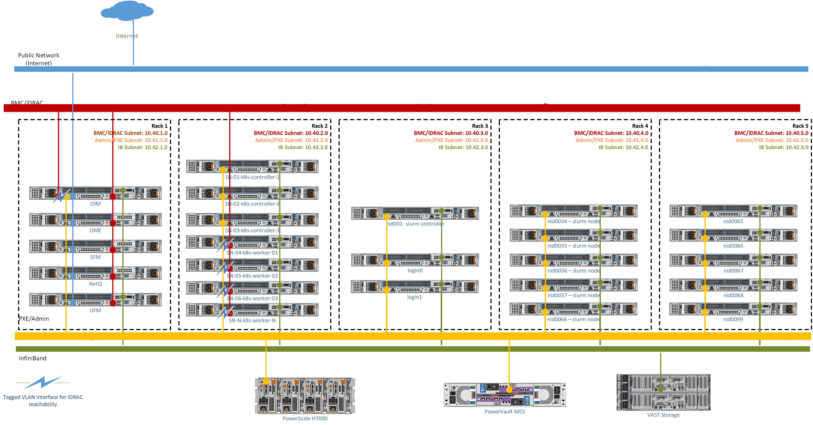

# Network Topologies

Omnia supports multiple network topology configurations to accommodate different deployment scenarios, hardware configurations, and operational requirements. The network topology defines how cluster nodes are interconnected through various network segments including Admin (PXE), BMC (iDRAC), Public, and InfiniBand networks.

## Choosing the right topology

Select a network topology based on your infrastructure requirements:

- **Dedicated Setup** -- Use when you have dedicated network infrastructure with separate physical connections for BMC (iDRAC) management. This provides the highest level of isolation and security for out-of-band management.

- **Shared LOM Setup** -- Ideal for deployments where network port availability is limited. The Administration and BMC networks share the same ethernet segment, reducing cabling requirements while maintaining functionality.

- **Hybrid Setup** -- Suitable for environments where the Omnia Infrastructure Manager (OIM) and special nodes (head, login) require public network access, while compute nodes use a shared LOM network for management and BMC.

- **Multi-Rack Multi-Subnet Setup** -- Designed for large-scale HPC and AI/ML deployments spanning multiple racks. Each rack has its own /24 subnet for the Admin network, improving scalability, failure isolation, and operational efficiency.

!!! note

    All topologies support classless IP addressing, allowing different subnets for Admin, BMC, Public, and Additional networks. For all topologies, OME-based BMC Discovery is the recommended discovery mechanism.

## Dedicated setup

!!! note

    The following diagram is for representational purposes only.

In a **Dedicated Setup**, all the cluster nodes (Head, Compute, and Login [optional]) have dedicated iDRAC connections.

- **Public Network (Blue line)** -- This indicates the external public network that is connected to the internet. NIC2 of the OIM is connected to the public network.

- **BMC Network (Red line)** -- This indicates the private BMC (iDRAC) network used by the OIM to control the cluster nodes using out-of-band management.

- **Admin Network (Green line)** -- This indicates the admin network used by Omnia to provision the cluster nodes. NIC1 of all the nodes are connected to the private switch.

- **InfiniBand Network (Yellow line)** -- This indicates the high-speed InfiniBand network used for high throughput inter-node communication in the cluster.

!!! note

    Omnia supports classless IP addressing, which allows the Admin network, BMC network, Public network, and the Additional network to be assigned different subnets.

**Recommended discovery mechanism**

- [Discovery Mechanisms](../HowTo/Setup/discover_nodes.md) (OME-based BMC Discovery is recommended)

## Shared LOM setup

!!! note

    The following diagram is for representational purposes only.

In a **Shared LOM setup**, the Administration and BMC logical networks share the same ethernet segment and physical connection.

- **Public Network (Blue line)** -- This indicates the external public network which is connected to the internet. NIC2 of the OIM is connected to the public network.

- **Admin Network and BMC network (Green line)** -- This indicates the admin network and the BMC network utilized by Omnia to provision the cluster nodes and to control the cluster nodes using out-of-band management. NIC1 of all the nodes are connected to the private switch.

- **InfiniBand Network (Yellow line)** -- This indicates the high-speed InfiniBand network used for high throughput inter-node communication in the cluster.

!!! note

    Omnia supports classless IP addressing, which allows the Admin network, BMC network, Public network, and the Additional network to be assigned different subnets.

**Recommended discovery mechanism**

- [Discovery Mechanisms](../HowTo/Setup/discover_nodes.md) (OME-based BMC Discovery is recommended)

## Hybrid setup

!!! note

    The following diagram is for representational purposes only.

In a **Hybrid Setup**, the OIM and special nodes such as the head and login node are connected to the public network, while the iDRAC and the compute nodes use a shared LOM network.

- **Public Network (Blue line)** -- This indicates the external public network which is connected to the internet. NIC2 of the OIM is connected to the public network.

- **Admin Network and BMC network (Green line)** -- This indicates the admin network and the BMC network utilized by Omnia to provision the cluster nodes and to control the cluster nodes using out-of-band management. NIC1 of all the nodes are connected to the private switch.

- **InfiniBand Network (Yellow line)** -- This indicates the high-speed InfiniBand network used for high throughput inter-node communication in the cluster.

!!! note

    Omnia supports classless IP addressing, which allows the Admin network, BMC network, Public network, and the Additional network to be assigned different subnets.

**Recommended discovery mechanism**

- [Discovery Mechanisms](../HowTo/Setup/discover_nodes.md) (OME-based BMC Discovery is recommended)

## Multi-rack multi-subnet setup

!!! note

    The following diagram is for representational purposes only.

In a **Multi-Rack Multi-Subnet Setup**, each rack has its own /24 subnet for the Admin (PXE) network. This architecture allows large-scale HPC and AI/ML deployments to have per-rack management subnets instead of a single shared subnet, improving scalability, failure isolation, and operational efficiency.

- **Public Network (Blue line)** -- This indicates the external public network that is connected to the internet. NIC2 of the OIM is connected to the public network.

- **BMC Network (Red line)** -- This indicates the private BMC (iDRAC) network used by the OIM to control the cluster nodes using out-of-band management.

- **Admin Network (Yellow line)** -- This indicates the admin network used by Omnia to provision the cluster nodes. NIC1 of all the nodes are connected to the private switch. In this topology, each rack has its own /24 subnet for the Admin network, and DHCP relay agents on Top-of-Rack (ToR) switches forward DHCP requests to the CoreDHCP server.

- **InfiniBand Network (Green line)** -- This indicates the high-speed InfiniBand network used for high throughput inter-node communication in the cluster.

- **Kubernetes Telemetry Access Network (Tagged VLAN)** -- This indicates a dedicated connectivity path for Kubernetes-based infrastructure monitoring and telemetry services that require access to the private BMC (iDRAC) network. A Kubernetes Worker Service Node is configured with a tagged VLAN interface mapped to the BMC VLAN, enabling secure access to iDRAC Redfish APIs for hardware health monitoring, power and thermal telemetry collection, firmware inventory, and event log retrieval.

!!! note

    Omnia supports classless IP addressing, which allows the Admin network, BMC network, Public network, and the Additional network to be assigned different subnets.

### OIM iDRAC Access Requirements

In the default configuration, the OIM requires access to iDRAC interfaces from the host OS for provisioning and telemetry operations. This introduces a dependency on an additional IP address being configured on the OIM host OS.

**Third VLAN Requirement**

The additional IP address for OIM iDRAC access should be assigned from a third VLAN that is separate from the existing iDRAC management subnet. This third VLAN provides:

- Isolation between OIM management traffic and BMC management traffic
- Separate routing paths for iDRAC access from the OIM
- Enhanced security by segregating OIM-to-iDRAC communication

**Deployment Scenarios**

Two deployment scenarios are supported:

#### Default Configuration

iDRAC IP assignment is configured on the OIM host OS to enable direct OIM access to iDRAC interfaces.

- **Requirements:**
  - Third VLAN configured on OIM with an IP address in the iDRAC-accessible subnet
  - Network routing configured to reach iDRAC interfaces via the third VLAN
  - No additional architectural changes required

#### Alternative Configuration

iDRAC IP assignment is not configured on the OIM host OS. In this scenario, OIM accesses iDRAC through alternative paths.

- **Architectural Changes Required:**
  - OIM must access iDRAC via the BMC network through intermediate nodes or proxy
  - Network topology must support indirect iDRAC access routes
  - Additional configuration may be required in `network_spec.yml` to specify alternative access paths

!!! note

    In the alternative configuration, the OIM does not have direct iDRAC access from the host OS. Instead, iDRAC access is achieved through:
    - SSH tunneling through intermediate nodes that have BMC network access
    - HTTP/HTTPS proxy configuration for iDRAC API access
    - Custom routing rules that redirect iDRAC traffic through designated gateway nodes

    This configuration requires careful network planning and may involve additional infrastructure components such as:
    - Bastion hosts or jump servers with BMC network connectivity
    - Proxy servers for iDRAC API access
    - Custom firewall rules to allow indirect iDRAC access paths

**Worker Node Third VLAN for Telemetry**

For iDRAC telemetry collection in multi-subnet environments, worker nodes may require VLAN tagging and static route configuration to reach BMC subnets. This configuration is **not** automatically performed as part of the deployment workflow.

- **Manual Configuration Required:**
  - VLAN interface creation on worker nodes
  - Static route configuration to reach BMC subnets
  - See [Worker Node VLAN Configuration for iDRAC Telemetry](../HowTo/Telemetry/worker_node_vlan_configuration_for_idrac_telemetry.md) for detailed steps

!!! note

    Manual VLAN configuration on worker nodes is required only when the worker nodes are in a different subnet than the BMC/iDRAC management network and need to reach BMC subnets for telemetry collection.

**Recommended discovery mechanism**

- [Discovery Mechanisms](../HowTo/Setup/discover_nodes.md) (OME-based BMC Discovery is recommended)

!!! info

    - [Architecture](architecture.md) -- How the OIM connects to each network segment.
    - [PXE Mapping File](../Reference/SampleFiles/pxe_mapping_file.md) -- How nodes are assigned IP addresses and roles across network segments.
